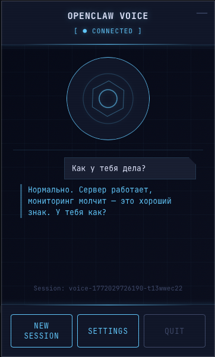

# OpenClaw Voice Client

[](https://opensource.org/licenses/MIT)
[](https://github.com/megastruktur/openclaw-voice-client)
[](https://github.com/mariozechner/openclaw)

A thin-client desktop application for voice-based interaction with OpenClaw Gateway. Speak naturally to your AI agent with push-to-talk, powered by Soniox speech-to-text.


*Tray-only app with push-to-talk voice input*

## Overview

OpenClaw Voice Client enables voice interaction with OpenClaw Gateway through a lightweight desktop application. The architecture follows a **thin-client principle**: all processing happens on the OpenClaw Gateway, the desktop app is just a UI shell for audio recording.

### Key Features

- 🎤 **Push-to-Talk Recording** - Hold button or hotkey to record
- 🗣️ **High-Quality Speech Recognition** - Powered by Soniox STT
- 🤖 **Full Agent Integration** - Complete access to OpenClaw agent tools
- 💬 **Conversation History** - Session-based context tracking
- 🔐 **Secure Token Storage** - OS keychain integration
- 🎯 **Tray-Only Interface** - Minimal, always-available UI
- 🌍 **Cross-Platform** - macOS, Windows, and Linux support

## Architecture

```
┌─────────────────────────────────────────────────────────────┐
│                    Desktop Application                       │
│  ┌──────────────┐  Push-to-talk  ┌──────────────────────┐  │
│  │ Tray Icon +  │ ──────────────> │ Audio Recording      │  │
│  │ Popup UI     │                 │ (cpal + hound, Rust) │  │
│  └──────────────┘                 └──────────────────────┘  │
└─────────────────────────┬───────────────────────────────────┘
                          │ HTTP POST
                          │ /voice-client/audio
                          ▼
┌─────────────────────────────────────────────────────────────┐
│                    OpenClaw Gateway                          │
│  ┌────────────────────────────────────────────────────┐     │
│  │           Voice Client Plugin                      │     │
│  │  ┌──────────────┐  ┌──────────────┐  ┌─────────┐ │     │
│  │  │ HTTP Server  │─>│ Soniox STT   │─>│ Agent   │ │     │
│  │  │ /voice-client│  │ Transcription│  │ Turn    │ │     │
│  │  └──────────────┘  └──────────────┘  └─────────┘ │     │
│  └────────────────────────────────────────────────────┘     │
│                          │                                   │
│                          │ Text Response                     │
│                          ▼                                   │
│  ┌────────────────────────────────────────────────────┐     │
│  │           Pi Agent (main)                          │     │
│  │  Tools: Memory, Calendar, Web Search, etc.        │     │
│  └────────────────────────────────────────────────────┘     │
└─────────────────────────────────────────────────────────────┘
```

### Thin-Client Principle

**All requests go FROM the desktop app TO OpenClaw. All responses come back FROM OpenClaw.**

- Desktop app only handles UI and audio recording
- OpenClaw plugin handles STT, agent turns, and TTS
- No external API calls from the desktop app
- Session management on the server side

## Requirements

- **OpenClaw Gateway** - v2026.2.21 or later
- **Soniox API Key** - [Sign up at soniox.com](https://soniox.com)
- **Desktop OS** - macOS 10.15+, Windows 10+, or Linux (Ubuntu 20.04+)

## Quick Start

### 1. Install the Plugin

Clone this repository and install the plugin into your OpenClaw Gateway:

```bash
git clone https://github.com/megastruktur/openclaw-voice-client.git
cd openclaw-voice-client

# Install the plugin
openclaw plugins install ./extensions/voice-client
```

### 2. Configure OpenClaw

Add the plugin configuration to your `openclaw.json`:

```json
{
  "plugins": {
    "entries": {
      "voice-client": {
        "config": {
          "enabled": true,
          "sonioxApiKey": "YOUR_SONIOX_API_KEY_HERE",
          "serve": {
            "port": 18790,
            "bind": "127.0.0.1",
            "path": "/voice-client"
          },
          "profiles": {
            "allowed": ["Alice", "Bob"]
          }
        }
      }
    }
  }
}
```

**⚠️ Important**: Replace `YOUR_SONIOX_API_KEY_HERE` with your actual Soniox API key.

Restart OpenClaw Gateway:

```bash
openclaw restart
```

Verify the plugin is running:

```bash
curl http://127.0.0.1:18790/voice-client/profiles
```

### 3. Download and Run the Desktop App

**Option A: Download Pre-built Release**

Download the latest release for your platform:

👉 **[Download from Releases](https://github.com/megastruktur/openclaw-voice-client/releases)**

- **macOS**: `OpenClaw-Voice-{version}.dmg`
- **Windows**: `OpenClaw-Voice-{version}.msi`

**Option B: Build from Source**

```bash
cd clients/voice-client-desktop
npm install
npx tauri build

# The built app will be in src-tauri/target/release/bundle/
# macOS: ~4MB .app bundle (vs ~150MB with Electron)
```

**First Run Setup:**

1. Launch the app (tray icon appears)
2. Click the tray icon → Open Settings
3. Configure:
   - **Gateway URL**: `http://127.0.0.1:18790/voice-client`
   - **Profile Name**: Your name (must be in `profiles.allowed`)
4. Test Connection
5. Save

## Usage

### Creating a Session

1. Click the tray icon to open the popup
2. Click **"New Session"**
3. Session ID appears at the bottom

### Voice Input

**Method 1: Mouse Button (Push-to-Talk)**

1. **Hold** the microphone button
2. Speak your message
3. **Release** to send

**Method 2: Hotkey (Global)**

1. Configure hotkey in Settings (e.g., `Ctrl+Space`)
2. Press and **hold** the hotkey anywhere
3. Speak your message
4. **Release** to send

### Viewing Responses

- Transcription appears instantly
- Agent response shows below
- Last exchange is saved in the popup

## Configuration Reference

### Plugin Configuration

All settings are configured in `openclaw.json` under `plugins.entries.voice-client.config`:

| Setting | Type | Default | Description |
|---------|------|---------|-------------|
| `enabled` | boolean | `true` | Enable/disable the plugin |
| `sonioxApiKey` | string | **required** | Your Soniox API key |
| `serve.port` | number | `18790` | HTTP server port |
| `serve.bind` | string | `"127.0.0.1"` | Bind address (`"0.0.0.0"` for network access) |
| `serve.path` | string | `"/voice-client"` | Base path for endpoints |
| `profiles.allowed` | string[] | `[]` | List of allowed profile names |

### Desktop App Settings

Settings are stored securely using OS keychain:

- **Gateway URL** - HTTP endpoint of the plugin (e.g., `http://127.0.0.1:18790/voice-client`)
- **Token** - Optional authentication token (encrypted in OS keychain)
- **Profile Name** - Your name (must match plugin's `profiles.allowed`)
- **Microphone Device** - Audio input device
- **Push-to-Talk Hotkey** - Global keyboard shortcut (e.g., `Ctrl+Space`, `Alt+T`)

### Example Configurations

**Local Development:**
```json
{
  "enabled": true,
  "sonioxApiKey": "sk_live_...",
  "serve": {
    "port": 18790,
    "bind": "127.0.0.1"
  },
  "profiles": {
    "allowed": ["Peter"]
  }
}
```

**Family Setup:**
```json
{
  "enabled": true,
  "sonioxApiKey": "sk_live_...",
  "serve": {
    "port": 18790,
    "bind": "0.0.0.0"
  },
  "profiles": {
    "allowed": ["Peter", "Olga", "Kids"]
  }
}
```

**Multi-Machine (Tailscale):**
```json
{
  "enabled": true,
  "sonioxApiKey": "sk_live_...",
  "serve": {
    "port": 18790,
    "bind": "0.0.0.0"
  },
  "profiles": {
    "allowed": ["Peter", "Laptop", "Desktop"]
  }
}
```

## API Endpoints

The plugin exposes these HTTP endpoints:

| Endpoint | Method | Description |
|----------|--------|-------------|
| `GET /voice-client/profiles` | GET | List allowed profiles |
| `POST /voice-client/session/new` | POST | Create new session |
| `GET /voice-client/session?id=<id>` | GET | Get session info |
| `POST /voice-client/audio?sessionId=<id>` | POST | Send audio for processing |

### Example: Send Audio

```bash
# Create session
SESSION_ID=$(curl -X POST http://127.0.0.1:18790/voice-client/session/new \
  -H "Content-Type: application/json" \
  -d '{"profileName":"Peter"}' | jq -r .sessionId)

# Send audio
curl -X POST "http://127.0.0.1:18790/voice-client/audio?sessionId=$SESSION_ID" \
  -H "X-Profile: Peter" \
  -H "Content-Type: audio/wav" \
  --data-binary @recording.wav
```

Response:
```json
{
  "transcription": {
    "text": "What's the weather today?",
    "confidence": 0.95
  },
  "response": {
    "text": "Let me check the weather for you..."
  }
}
```

## Building from Source

### Plugin

The plugin is written in TypeScript and uses OpenClaw's plugin SDK:

```bash
cd extensions/voice-client
npm install
npm run build

# Install to OpenClaw
openclaw plugins install .
```

### Desktop App

The desktop app uses Tauri v2 + Rust + vanilla TypeScript:

```bash
cd clients/voice-client-desktop
npm install

# Requires Rust toolchain: https://rustup.rs/

# Development (hot reload)
npm run tauri:dev

# Production build
npm run tauri:build

# The built app will be in src-tauri/target/release/bundle/
```

## Development

### Project Structure

```
openclaw-voice-client/
├── extensions/voice-client/       # OpenClaw plugin
│   ├── index.ts                   # Plugin entry point
│   ├── openclaw.plugin.json       # Plugin manifest
│   └── src/
│       ├── agent-service.ts       # Agent turn integration
│       ├── channel.ts             # Channel plugin
│       ├── http-handler.ts        # HTTP server
│       ├── session-manager.ts     # Session management
│       ├── stt-service.ts         # Soniox STT
│       └── types.ts               # TypeScript types
│
└── clients/voice-client-desktop/  # Tauri v2 app
    ├── src/                        # Frontend (vanilla TypeScript)
    │   ├── popup.html              # Popup window
    │   ├── popup.ts                # Popup logic
    │   ├── popup.css               # Popup styles
    │   ├── settings.html           # Settings window
    │   ├── settings.ts             # Settings logic
    │   ├── settings.css            # Settings styles
    │   └── types.ts                # TypeScript interfaces
    ├── src-tauri/                   # Rust backend
    │   ├── src/
    │   │   ├── main.rs             # Binary entry point
    │   │   ├── lib.rs              # App setup, tray, windows
    │   │   ├── types.rs            # Shared types
    │   │   ├── audio.rs            # cpal recording + hound WAV
    │   │   ├── api.rs              # reqwest HTTP client
    │   │   ├── settings.rs         # Store + keyring
    │   │   └── commands.rs         # Tauri IPC commands
    │   ├── Cargo.toml              # Rust dependencies
    │   ├── tauri.conf.json         # Tauri configuration
    │   ├── Entitlements.plist      # macOS entitlements
    │   └── capabilities/           # Tauri permissions
    ├── vite.config.ts              # Vite build config
    ├── package.json                # Node dependencies
    └── tsconfig.json               # TypeScript config
```

### Plugin Development

The plugin follows OpenClaw's plugin architecture:

1. **Entry Point** (`index.ts`) - Registers channel and service
2. **HTTP Handler** (`http-handler.ts`) - HTTP server with endpoints
3. **STT Service** (`stt-service.ts`) - Soniox API integration
4. **Agent Service** (`agent-service.ts`) - OpenClaw agent turns
5. **Session Manager** (`session-manager.ts`) - Conversation history

### Desktop App Development

The app uses:

- **Tauri v2** - Desktop framework (Rust backend + webview frontend)
- **Rust** - Backend (audio, networking, settings, IPC)
- **Vanilla TypeScript** - Frontend UI (no framework)
- **Vite** - Build tool

Key components:

- `audio.rs` - Native audio recording via cpal, WAV encoding via hound
- `api.rs` - HTTP client (reqwest) for gateway communication
- `commands.rs` - 9 Tauri IPC commands bridging frontend to Rust
- `settings.rs` - Settings persistence (tauri-plugin-store + keyring)
- `popup.ts` - Main popup UI logic
- `settings.ts` - Settings UI logic

### Testing

**Plugin:**
```bash
# Test endpoints
curl http://127.0.0.1:18790/voice-client/profiles

# Test transcription
curl -X POST "http://127.0.0.1:18790/voice-client/audio?sessionId=test-123" \
  -H "X-Profile: Peter" \
  --data-binary @test-audio.wav
```

**Desktop App:**
```bash
# Run in dev mode with hot reload
npm run tauri:dev
```

## Troubleshooting

### Plugin Issues

**Connection Failed**

- Verify OpenClaw is running: `openclaw status`
- Check plugin is enabled: `openclaw plugins list`
- Test endpoint: `curl http://127.0.0.1:18790/voice-client/profiles`

**Profile Not Allowed**

- Ensure your profile name is in `profiles.allowed`
- Profile names are case-sensitive
- Restart OpenClaw after config changes

**Soniox API Errors**

- Verify API key is correct
- Check Soniox account status and quota
- Review OpenClaw logs: `openclaw logs`

### Desktop App Issues

**Cannot Connect to Gateway**

- Check Gateway URL in settings
- Ensure OpenClaw Gateway is running
- Verify firewall allows connection
- Test with curl first

**Microphone Not Working**

- Grant microphone permissions to the app
- Select correct device in Settings
- Check no other app is using the microphone


**Hotkey Not Working**

- Ensure hotkey format is correct (e.g., `Ctrl+Space`)
- Check hotkey isn't used by another app
- Restart app after changing hotkey
- Some keys may be reserved by OS

**Token Storage Failed (Linux)**

- Install libsecret: `sudo apt install libsecret-1-0`
- Or use kwallet if on KDE

## Security

### Token Storage

- Desktop app uses the `keyring` crate for secure token storage
- Tokens are encrypted using OS keychain:
  - **macOS**: Keychain
  - **Windows**: Windows Credential Manager
  - **Linux**: libsecret or kwallet

### Network Security

- **Default**: Local HTTP (LAN only)
- **Recommended for WAN**: Use HTTPS with reverse proxy
- **Profile Validation**: Server-side allowlist
- **Session Management**: Server-side only

### Best Practices

1. **Never commit API keys** to version control
2. **Use strong tokens** if exposing over network
3. **Enable HTTPS** for WAN access
4. **Restrict profiles** to known users
5. **Monitor logs** for unauthorized access

## Contributing

Contributions are welcome! Please:

1. Fork the repository
2. Create a feature branch (`git checkout -b feature/amazing-feature`)
3. Commit your changes (`git commit -m 'Add amazing feature'`)
4. Push to the branch (`git push origin feature/amazing-feature`)
5. Open a Pull Request

### Development Setup

```bash
# Clone repo
git clone https://github.com/megastruktur/openclaw-voice-client.git
cd openclaw-voice-client

# Install plugin dependencies
cd extensions/voice-client
npm install

# Install desktop app dependencies
cd ../../clients/voice-client-desktop
npm install
```

### Code Style

- TypeScript strict mode
- Rust (cargo clippy, no unwrap in production)
- Conventional commits

## Roadmap

- [ ] **Streaming STT** - Real-time transcription
- [ ] **TTS Integration** - Voice responses from agent
- [ ] **Audio Playback** - Play agent responses as audio
- [ ] **Multiple Sessions** - Switch between conversations
- [ ] **History Browser** - View past conversations
- [ ] **Offline Mode** - Queue messages when disconnected
- [ ] **Multi-Language** - i18n support
- [ ] **Voice Activity Detection** - Auto-start recording
- [ ] **Custom Hotkeys** - Configurable shortcuts
- [ ] **Themes** - Light/dark mode

## Credits

- **OpenClaw** - [mariozechner/openclaw](https://github.com/mariozechner/openclaw)
- **Soniox** - Speech-to-text API
- **Tauri v2** - Desktop framework
- **Rust** - Backend language
- **cpal** - Cross-platform audio
- **hound** - WAV encoding

## License

MIT License - see [LICENSE](LICENSE) file for details.

Copyright (c) 2026 OpenClaw Voice Client Contributors

## Support

- **Issues**: [GitHub Issues](https://github.com/megastruktur/openclaw-voice-client/issues)
- **Discussions**: [GitHub Discussions](https://github.com/megastruktur/openclaw-voice-client/discussions)
- **OpenClaw**: [OpenClaw Documentation](https://github.com/mariozechner/openclaw)

---

**Built with ❤️ for the OpenClaw community**
